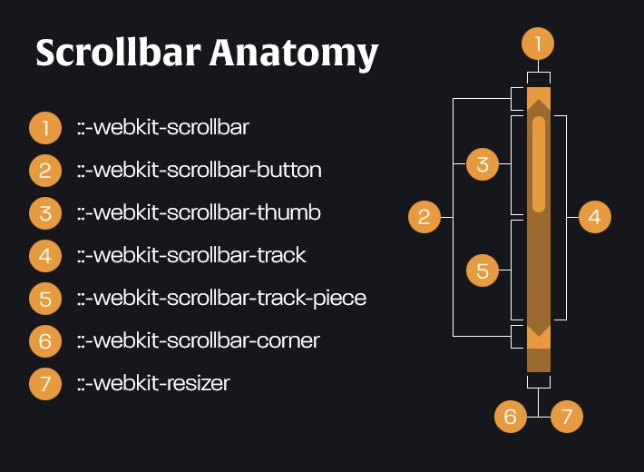

---
nav:
  title: 应用
  order: 4
title: 滚动条
order: 10
---

# 滚动条

## Webkit 内核滚动条

| 滚动条伪元素                      |               说明               |
| :-------------------------------- | :------------------------------: |
| `::-webkit-scrollbar`             |          滚动条整体部分          |
| `::-webkit-scrollbar-button`      |         滚动条两端的按钮         |
| `::-webkit-scrollbar-track`       |             外层轨道             |
| `::-webkit-scrollbar-track-piece` | 内层轨道，滚动条中间部分（除去） |
| `::-webkit-scrollbar-thumb`       |    滚动条里面可以拖动的那部分    |
| `::-webkit-scrollbar-corner`      |               边角               |
| `::-webkit-resizer`               |      定义右下角拖动块的样式      |

 

更丰富的滚动条样式：

| 滚动条伪类        |                                              说明                                              |
| :---------------- | :--------------------------------------------------------------------------------------------: |
| `:horizontal`     |                                  适用于任何水平方向上的滚动条                                  |
| `:vertical`       |                                   适用于任何垂直方向的滚动条                                   |
| `:decrement`      |   适用于按钮和轨道碎片。表示递减的按钮或轨道碎片，例如可以使区域向上或者向右移动的区域和按钮   |
| `:increment`      |   适用于按钮和轨道碎片。表示递增的按钮或轨道碎片，例如可以使区域向下或者向左移动的区域和按钮   |
| `:start`          |               适用于按钮和轨道碎片。表示对象（按钮 轨道碎片）是否放在滑块的前面                |
| `:end`            |               适用于按钮和轨道碎片。表示对象（按钮 轨道碎片）是否放在滑块的后面                |
| `:double-button`  | 适用于按钮和轨道碎片。判断轨道结束的位置是否是一对按钮。也就是轨道碎片紧挨着一对在一起的按钮。 |
| `:single-button`  |  适用于按钮和轨道碎片。判断轨道结束的位置是否是一个按钮。也就是轨道碎片紧挨着一个单独的按钮。  |
| `:no-button`      |                                  表示轨道结束的位置没有按钮。                                  |
| `:corner-present` |                                   表示滚动条的角落是否存在。                                   |
| `:corner-present` |                 适用于所有滚动条，表示包含滚动条的区域，焦点不在该窗口的时候。                 |

 

<code src="../../example/application-scrollbar/basic/index.tsx" />

## 参考资料

- [📝 Styling Scrollbar](https://www.webkit.org/blog/363/styling-scrollbars/)
- [🌰 CSS Scroll Bars](https://codepen.io/GhostRider/details/GHaFw)
